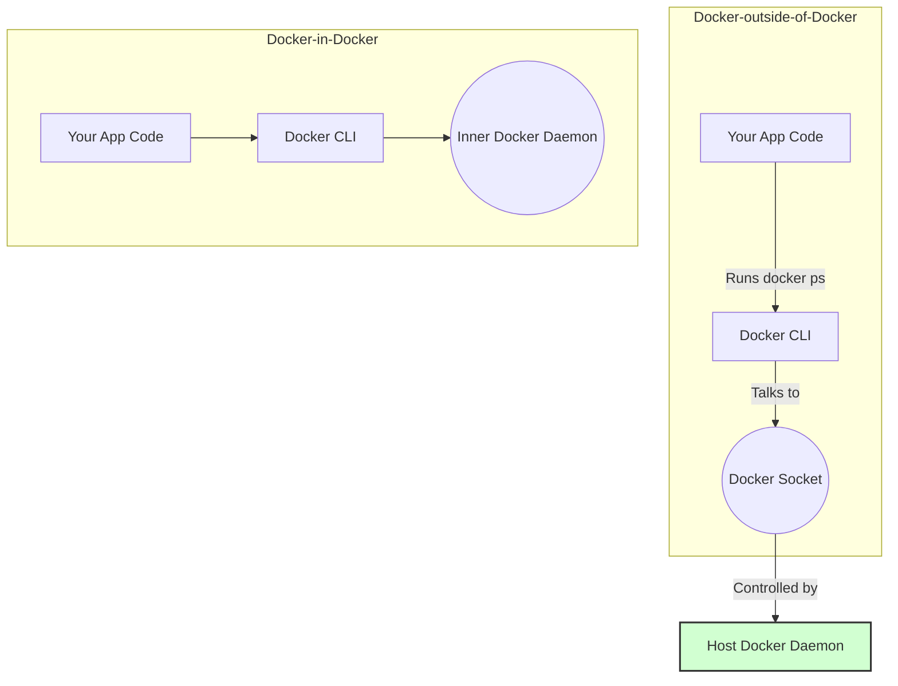

# 🐳 Docker-outside-of-Docker with a Non-Root `ci` User

This project builds a Docker container that can run Docker commands inside itself — **without running a Docker daemon inside**. This method is called **Docker-outside-of-Docker** (Do-o-D), and it securely uses the host Docker daemon via a mounted socket.

---

## 🔧 What's inside this container?

- ✅ `docker` CLI
- ✅ User `ci` (non-root)
- ✅ Access to the host’s Docker daemon
- ✅ Custom group mapping to match your host Docker socket permissions

---

## 🧠 What is "Docker-outside-of-Docker"?

> **Docker-outside-of-Docker** (Do-o-D) means running Docker commands inside a container **using the host's Docker engine**.

This is done by **mounting the Docker socket** from the host into the container:

```bash
-v /var/run/docker.sock:/var/run/docker.sock
````

---

### 🧬 Do-o-D vs Di-n-D



🟢 **Do-o-D** is preferred for performance and simplicity
🔴 **Docker-in-Docker** (`dind`) requires `--privileged` and runs a nested daemon — risky and slow

---

## 📁 Dockerfile Overview

```Dockerfile
FROM docker:25.0.3-cli

ARG DOCKER_GID=989

RUN delgroup docker || true && \
    addgroup -g ${DOCKER_GID} docker && \
    addgroup -g 1001 ci && \
    adduser -D -u 1001 -G ci -s /bin/sh ci && \
    adduser ci docker

USER ci
WORKDIR /home/ci
CMD ["sh"]
```

---

## ✅ Setup (from WSL2 or native Linux)

### 1. Find your host's Docker GID

```bash
getent group docker
```

Look for the number at the end (e.g., `docker:x:989:youruser`). Use that number in the next step.

---

### 2. Build the Docker image

```bash
docker build --build-arg DOCKER_GID=989 -t dood-ci .
```

Replace `989` with your host’s Docker GID.

---

### 3. Run the container

```bash
docker run --rm -it -v /var/run/docker.sock:/var/run/docker.sock --name dood dood-ci
```

You’re now inside the container as user `ci`.

Try running:

```sh
docker ps
```

If everything is correct, this will show your host containers — you're using **the host Docker engine from inside a container**, securely!

---

## 🔐 Security Note

Accessing `/var/run/docker.sock` gives **root-level control** of the host. Even though you're using a non-root user (`ci`), **this user still has access to Docker**.

> Never expose this setup to untrusted users or containers.

---

## 📦 Use Cases

* CI/CD runners
* Automation pipelines inside containers
* Docker image builders that need to run Docker commands
* Dev containers with build tools

---

If 