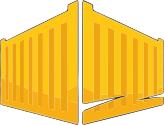

# Container universe

Welcome to my containerization learning repository! Here you'll find my personal notes, practical implementations, and hands-on experiments as I dive deep into the world of Docker, containers, and orchestration technologies. This repository serves as both a learning log and a reference guide for container technologies, from basic concepts to advanced deployment strategies.

    

## Contents
- [DockerOutOfDocker](DockerOutOfDocker/README.md): Running Docker commands inside a container using the host's Docker engine.

